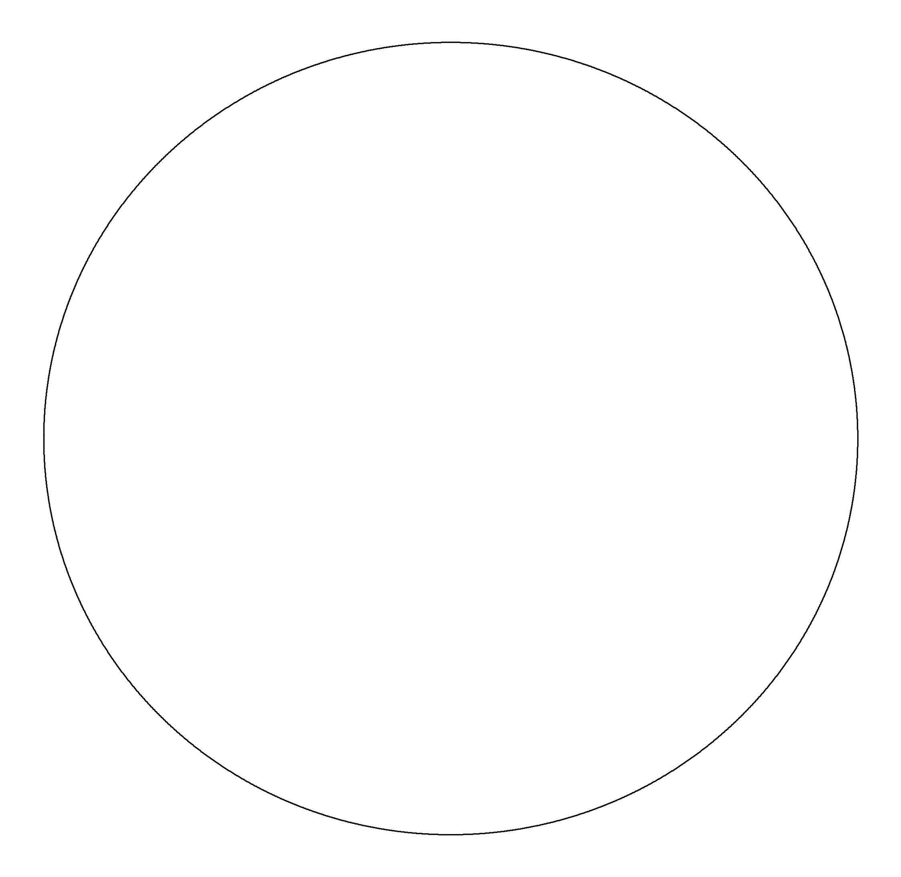
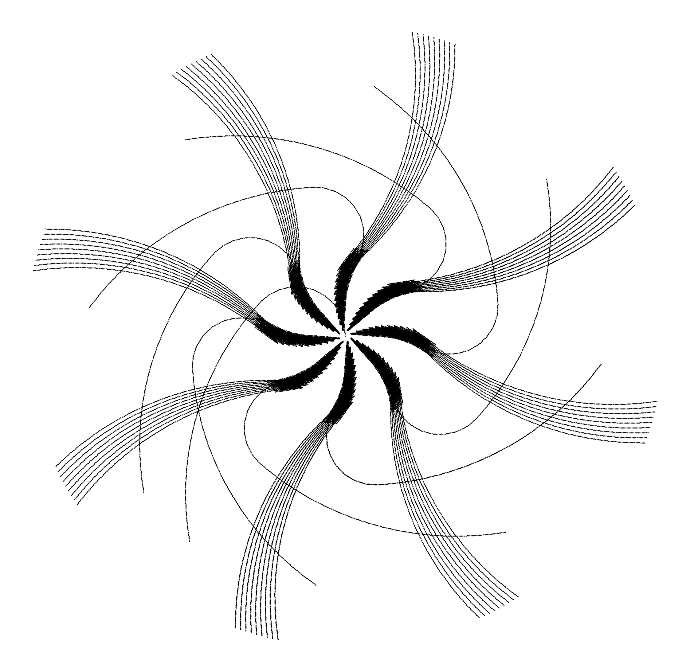

# turtlepen
A simple pattern drawing toy inspired by [Turtle](https://turtleacademy.com/) and [Waterbear](http://waterbearlang.com). 

The source code is explicitly kept concise for easy understanding and modification.
--- 


## Example usage

### Example 1
```python
from turtlepen import blocks, tools, turtle

# create a turtle
turtle = Turtle()

# draw a circle by repeating the following action for 360 times:
# move the turtle 10 steps ahead and change its direction by 1 degree
action = Repeat(360,
                [
                    Rotate(1),
                    Forward(10),
                ])

# apply compiled action blocks to turtle
action(turtle)

# visualize turtle's trace
visualize_trace(turtle)
```

`Output:`


--- 

### Example 2
```python
from turtlepen import blocks, tools, turtle

# create a turtle
turtle = Turtle()

# compile actions blocks representing a series of actions
# to draw a complex pattern
action = Repeat(10,
                [
                    Rotate(-5),
                    Repeat(10, [
                        Forward(10),
                        Rotate(-14),
                    ]),
                    Repeat(10, [
                        Rotate(5),
                        Repeat(17, [
                            Forward(13),
                            Rotate(-3),
                        ]),
                        BackToCenter(),
                        Rotate(3),
                        Repeat(11, [
                            PenUp(),
                            Forward(29),
                            PenDown(),
                            Rotate(4),
                            Forward(-24),
                        ])
                    ]),
                ])

# apply compiled action blocks to turtle
action(turtle)

# visualize turtle's trace
visualize_trace(turtle)
```

`Output:`


---

### Experimental

A mini-language parser with the following single-letter commands:


    P -> Repeat
    R -> Rotate
    F -> Forward
    U -> PenUp
    D -> PenDown
    B -> BackToCenter

    where indented lines following `P` are repeated by `P`.

For instance, the script below is equivalent to Example 2 above:
```
P 10
    R -5
    P 10
        F 10
        R -14
    R 10
        R 5
        P 17
            F 13
            R -3
        B
        R 3
        P 11
            U
            F 29
            D
            R 4
            F -24
```